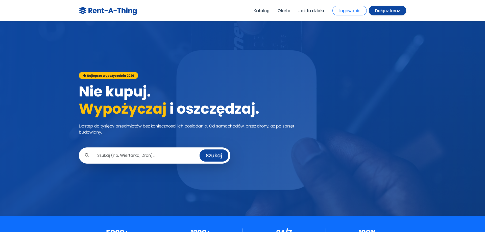
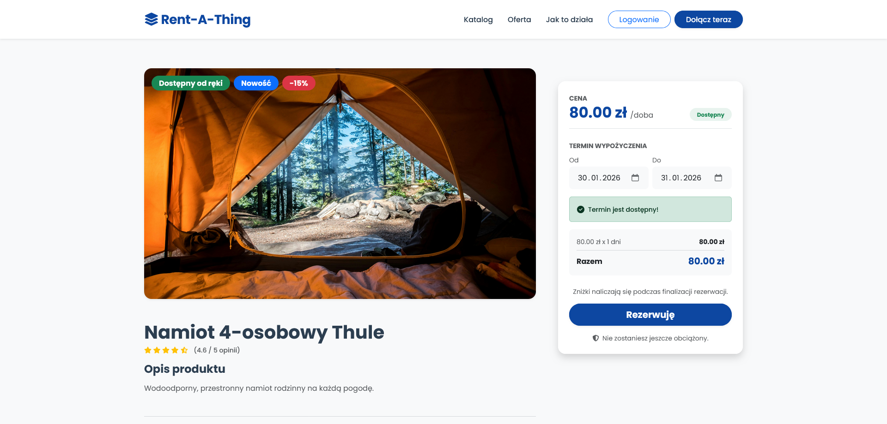
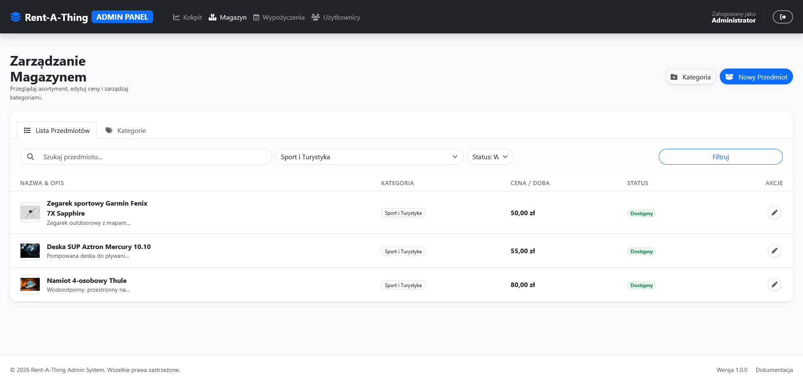
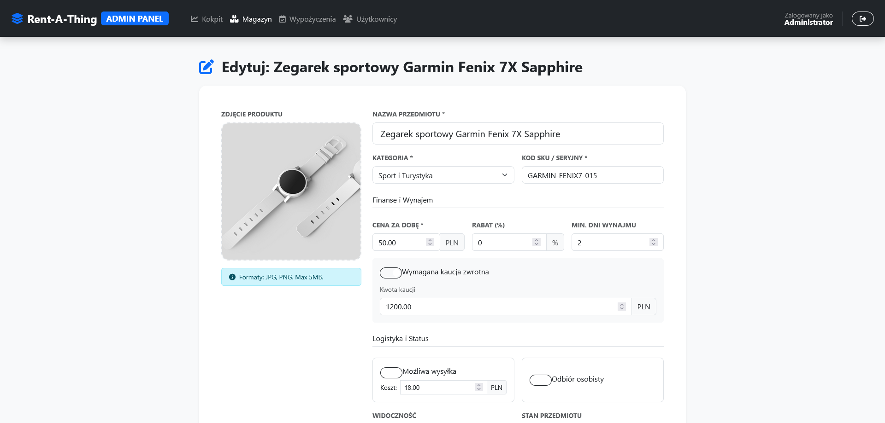
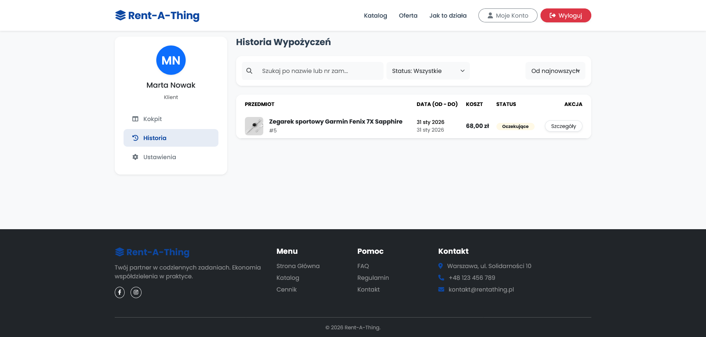
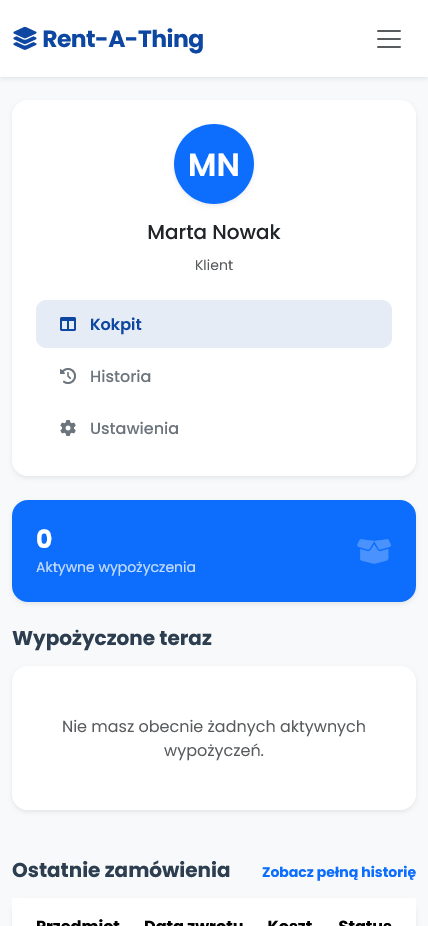

# RentAThing - System Wypożyczalni Online


> **"Nie kupuj. Wypożyczaj i oszczędzaj."**

Kompleksowa platforma webowa do zarządzania wypożyczalnią przedmiotów (od elektroniki, przez narzędzia, aż po pojazdy). Aplikacja umożliwia użytkownikom przeglądanie asortymentu, rezerwację terminów, a administratorom pełną kontrolę nad magazynem i zamówieniami.


---

## Przeznaczenie Aplikacji

Celem projektu jest stworzenie nowoczesnego i intuicyjnego systemu obsługi wypożyczalni, który automatyzuje proces najmu. Aplikacja rozwiązuje problem zarządzania dostępnością przedmiotów w czasie rzeczywistym oraz eliminuje konieczność ręcznego prowadzenia ewidencji.

**Główne cele biznesowe:**
* Umożliwienie klientom rezerwacji sprzętu 24/7.
* Automatyzacja obliczania kosztów (cena za dobę + kaucja + wysyłka).
* Centralizacja zarządzania magazynem i użytkownikami dla administratora.

---

##  Kluczowe Funkcjonalności

###  Panel Użytkownika (Klienta)
* **Katalog Produktów:** Zaawansowane wyszukiwanie i filtrowanie (po kategorii, cenie, dostępności).
* **System Rezerwacji:** Wybór dat w kalendarzu z dynamicznym sprawdzaniem dostępności (bez przeładowania strony).
* **Kalkulator Kosztów:** Automatyczne wyliczanie ceny końcowej z uwzględnieniem dni, kaucji i zniżek.
* **Profil:** Historia zamówień, statusy aktywnych wypożyczeń, edycja danych i zmiana hasła.
* **Opinie:** Możliwość dodawania ocen i recenzji do wypożyczonych przedmiotów.


###  Panel Administratora
* **Dashboard:** Statystyki w czasie rzeczywistym.
* **Zarządzanie Magazynem (Inventory):** CRUD przedmiotów, dodawanie zdjęć, ustalanie cen i kaucji.
* **Zarządzanie Wypożyczeniami:** Zmiana statusów (Rezerwacja -> Wydanie -> Zwrot), obsługa zwrotów z notatkami o stanie sprzętu.
* **Zarządzanie Użytkownikami:** Blokowanie/odblokowywanie kont, podgląd danych.
* **Raportowanie:** Eksport danych do plików **CSV**.

## 3. Wymagania systemowe i sprzętowe

Aby uruchomić aplikację lokalnie lub na serwerze, Twoje środowisko musi spełniać poniższe wymagania.

###  Wymagania Programowe (Software)

* **Java Development Kit (JDK):** Wersja **21** (wymagane przez `<java.version>21</java.version>`).
* **System budowania:** Apache Maven 3.8+ (zalecane korzystanie z wbudowanego wrappera `./mvnw`).
* **Baza danych:**
    * MySQL 8.0+ (produkcyjnie/dewelopersko - sterownik `mysql-connector-j`).
    * H2 (opcjonalnie do szybkich testów w pamięci RAM).
* **Przeglądarka:** Nowoczesna przeglądarka internetowa (Chrome, Firefox, Edge, Safari) z obsługą HTML5 i CSS3 (dla interfejsu Thymeleaf + Bootstrap).

###  Wymagania Sprzętowe (Serwer / Środowisko lokalne)

Aplikacja oparta na Spring Boot 3 jest dość lekka, ale wymaga odpowiednich zasobów do startu maszyny wirtualnej Java (JVM).

| Komponent | Minimalne | Zalecane |
| :--- | :--- | :--- |
| **Procesor (CPU)** | 2 rdzenie (2.0 GHz) | 4 rdzenie (i5 / Ryzen 5 lub vCPU) |
| **Pamięć RAM** | 2 GB (dla samej aplikacji) | 4 GB+ (dla systemu + DB + IDE) |
| **Dysk** | 500 MB wolnego miejsca | 10 GB (uwzględniając bazę danych) |

###  Konfiguracja IDE (IntelliJ / Eclipse)

Projekt wykorzystuje bibliotekę **Project Lombok** oraz **MapStruct**. Aby uniknąć błędów kompilacji w IDE:

1.  Zainstaluj wtyczkę **Lombok Plugin**.
2.  Włącz opcję **Annotation Processing** w ustawieniach kompilatora.
    * *IntelliJ:* `Settings` -> `Build, Execution, Deployment` -> `Compiler` -> `Annotation Processors` -> Zaznacz `Enable annotation processing`.
  
## Konfiguracja (application.properties)

Przed uruchomieniem aplikacji upewnij się, że skonfigurowałeś plik `src/main/resources/application.yml` lub  `src/main/resources/application-mysql.yml` . Jeśli chcesz korzystać z bazy MySql, skonfiguruj ustawienia oraz wgraj schemat bazy danych `database_schema.sql`. Uruchom
aplikacje z profilem `mysql`. Jeśli chcesz korzystać z produkcyjnej bazy danych H2 nie musisz nic konfigurować.

```properties
spring:
  datasource:
    url: jdbc:mysql://localhost:3306/rentathing_db?serverTimezone=UTC&useSSL=false&allowPublicKeyRetrieval=true
    username: root
    password: twoje_haslo
    driver-class-name: com.mysql.cj.jdbc.Driver

  jpa:
    database-platform: org.hibernate.dialect.MySQL8Dialect
    hibernate:
      ddl-auto: validate

  liquibase:
    enabled: true
    drop-first: false
    change-log: classpath:/db/changelog/changelog-master.xml
````
##  Sposób użycia

Po uruchomieniu aplikacji (`http://localhost:8080`), system oferuje dwa główne interfejsy: dla Klienta oraz dla Administratora.

###  Dane logowania (Demo)

Jeśli załadowałeś przykładowe dane (poprzez Liquibase lub skrypt SQL), możesz użyć poniższych kont. W przeciwnym razie **zarejestruj nowe konto** na stronie logowania (nowe konta otrzymują rolę `USER`).

| Rola | Login (Email) | Hasło | Uprawnienia |
| :--- | :--- | :--- | :--- |
| **Administrator** | `admin@admin.pl` | `Secret1324` | Pełny dostęp do panelu `/admin`. |
| **Użytkownik** | `user@user.com` | `Marta2026` | Rezerwacja sprzętu, historia zamówień. |

---

### Scenariusz 1: Ścieżka Klienta (Wypożyczenie)

1.  **Przeglądanie oferty:**
    * Na stronie głównej skorzystaj z wyszukiwarki lub wybierz **Katalog** na pasku nawigacji.
    * Możesz filtrować wyniki po cenie, kategorii, dostępności oraz sortowac.
2.  **Rezerwacja:**
    * Wejdź w szczegóły wybranego przedmiotu.
    * Wybierz **Datę odbioru** i **Datę zwrotu** w kalendarzu. System automatycznie przeliczy koszt i sprawdzi dostępność.
    * Jeśli przedmiot jest dostępny, możesz przejść do formularza rezerwacji.
    * Kliknij **Rezerwuję** (wymagane zalogowanie).
3.  **Finalizacja zamówienia:**
    * Wybierz sposób dostawy: *Odbiór osobisty* lub *Kurier*.
    * Wybierz metodę płatności: *Karta*, *BLIK* lub *Płatność przy odbiorze*.
    * Zatwierdź przyciskiem **Potwierdzam i Płacę** lub **Rezerwuje**.
4.  **Panel Klienta:**
    * Przejdź do zakładki **Moje Konto**, aby śledzić status rezerwacji (np. *Oczekująca*, *W trakcie*, *Zakończona*).

---

###  Scenariusz 2: Ścieżka Administratora (Zarządzanie)

Zaloguj się kontem z uprawnieniami administratora, aby wejść do panelu zarządzania.

1.  **Zarządzanie Magazynem (`/admin/inventory`):**
    * Dodawaj nowe przedmioty, określając ich nazwę, kategorię, cenę za dobę oraz kaucję.
    * Możesz wgrywać zdjęcia produktów oraz zmieniać ich status (ukryty/widoczny).
3.  **Baza Użytkowników (`/admin/users`):**
    * Przeglądaj listę zarejestrowanych klientów.
    * W razie naruszeń regulaminu, masz możliwość **zablokowania** konta użytkownika.
4.  **Raportowanie:**
    * Użyj przycisku **Eksportuj do CSV** w zakładce Wypożyczenia lub Użytkownicy, aby pobrać dane do analizy w Excelu.

---
##  Wykorzystane narzędzia i biblioteki

Projekt został zrealizowany przy użyciu następujących technologii i bibliotek, z zachowaniem wskazanych wersji:

### Backend (Core)
* **Java:** `21` (LTS)
* **Spring Boot:** `3.4.2`
    * `spring-boot-starter-web` (REST API, Tomcat)
    * `spring-boot-starter-security` (Autoryzacja i Uwierzytelnianie)
    * `spring-boot-starter-data-jpa` (Hibernate, obsługa bazy danych)
    * `spring-boot-starter-validation` (Walidacja formularzy i DTO)
    * `spring-boot-starter-thymeleaf` (Silnik szablonów)

### Baza Danych
* **MySQL Connector/J:** `8.x` (Zarządzany przez Spring Boot)
* **H2 Database:** (Baza in-memory do testów/dev)
* **Liquibase Core:** (Wersjonowanie schematu bazy danych)
* **Liquibase Maven Plugin:** `4.24.0`

### Narzędzia i Biblioteki Pomocnicze
* **MapStruct:** `1.5.5.Final` (Mapowanie encji na DTO)
* **Project Lombok:** (Redukcja boilerplate code, wersja zarządzana przez Spring Boot)
* **OpenCSV:** `5.9` (Generowanie raportów i eksport danych)
* **Thymeleaf Extras Spring Security 6:** (Integracja bezpieczeństwa w widokach)

### Frontend
* **Bootstrap:** `5.3` (Framework CSS - bazując na klasach w szablonach)
* **FontAwesome:** `6.x` (Ikony - bazując na składni `fa-solid`)
* **JavaScript:** Vanilla JS (Obsługa logiki klienta, np. kalkulator cen)

### Środowisko Budowania
* **Apache Maven:** `3.8+`
* **Lombok Mapstruct Binding:** `0.2.0` (Integracja procesorów adnotacji)

##  Wykorzystanie cech programowania obiektowego (OOP)

Projekt został zaprojektowany zgodnie z paradygmatami programowania obiektowego, co zapewnia modularność, łatwość w utrzymaniu oraz skalowalność kodu. Poniżej opisano kluczowe filary OOP zastosowane w aplikacji:

### 1. Hermetyzacja (Encapsulation)
Ukrywanie wewnętrznego stanu obiektów i udostępnianie go jedynie poprzez ściśle zdefiniowany interfejs.

* **Prywatne pola w encjach:** Klasy modelu (np. `User`, `Item`, `Rental`) posiadają pola o modyfikatorze dostępu `private`. Dostęp do nich odbywa się wyłącznie przez gettery i settery (generowane automatycznie przez **Lombok**), co chroni dane przed niekontrolowaną modyfikacją.
* **Wzorzec DTO (Data Transfer Object):** Warstwa widoku (Thymeleaf) nie operuje bezpośrednio na encjach bazodanowych. Zamiast tego wykorzystywane są obiekty DTO (np. `RentalCreateDto`, `RegisterRequest`), które przenoszą tylko niezbędne dane, ukrywając strukturę bazy danych przed warstwą prezentacji.

### 2. Abstrakcja (Abstraction)
Ukrywanie skomplikowanej logiki implementacyjnej i eksponowanie jedynie kluczowych funkcjonalności.

* **Warstwa Serwisów:** Logika biznesowa (np. obliczanie kosztu wypożyczenia, walidacja dostępności terminu) jest odseparowana od kontrolerów i zamknięta w klasach serwisowych (`RentalService`, `ItemService`). Kontroler "nie wie", jak obliczana jest cena – on tylko wywołuje odpowiednią metodę serwisu.
* **Spring Data JPA:** Interfejsy repozytoriów (np. `ItemRepository`) abstrahują skomplikowane zapytania SQL. Programista używa metod takich jak `findAllByCategory()`, nie martwiąc się o niskopoziomową obsługę połączenia z bazą danych JDBC.

### 3. Dziedziczenie (Inheritance)
Tworzenie hierarchii klas w celu ponownego wykorzystania kodu.

* **Rozszerzanie Repozytoriów:** Interfejsy repozytoriów dziedziczą po `JpaRepository` (np. `public interface UserRepository extends JpaRepository<User, Long>`), dzięki czemu automatycznie zyskują zestaw gotowych metod CRUD bez konieczności ich implementacji.
* **Wyjątki:** Własne klasy wyjątków (np. `ItemNotFoundException`) dziedziczą po klasie ItemException która dziedziczy standardowej klasie `RuntimeException`, co pozwala na spójną obsługę błędów w całej aplikacji.

### 4. Polimorfizm (Polymorphism)
Możliwość traktowania obiektów różnych typów w jednolity sposób.

* **Wstrzykiwanie Zależności (Dependency Injection):** Kontrolery operują na interfejsach serwisów, a nie na ich konkretnych implementacjach. Dzięki temu Spring może wstrzyknąć odpowiednią implementację beana w czasie działania aplikacji (`@Autowired`).
* **Statusy Wypożyczeń:** Wykorzystanie typu wyliczeniowego `Enum` (`RentalStatus`) pozwala na jednolite traktowanie różnych stanów zamówienia (ACTIVE, RETURNED, OVERDUE) i sterowanie logiką (np. kolorami odznak w panelu admina) w sposób polimorficzny w szablonach Thymeleaf.

##  Inne rozwiązania projektowe

Poniżej przedstawiono dodatkowe mechanizmy i decyzje architektoniczne wdrożone w celu poprawy bezpieczeństwa, wydajności oraz User Experience (UX):

###  Asynchroniczna weryfikacja dostępności (AJAX)
Zamiast przeładowywać całą stronę przy wyborze dat rezerwacji, zaimplementowano mechanizm **AJAX** (przy użyciu `fetch` API).
* Gdy klient wybiera zakres dat w kalendarzu, aplikacja wysyła zapytanie w tle do endpointu REST.
* Serwer weryfikuje kolizje terminów w bazie danych w czasie rzeczywistym.
* Interfejs użytkownika (cena, status dostępności) aktualizuje się natychmiastowo bez odświeżania strony.

###  Modularyzacja widoków (Thymeleaf Fragments)
W celu zachowania zasady **DRY (Don't Repeat Yourself)** i ułatwienia utrzymania kodu, powtarzalne elementy interfejsu zostały wydzielone do osobnych komponentów (fragmentów):
* `fragments/nav` – Globalna nawigacja z dynamicznym statusem logowania.
* `fragments/user-sidebar` – Menu boczne panelu klienta (z aktywnym podświetlaniem sekcji).
* `fragments/toast` – Uniwersalny kontener powiadomień.
* `fragments/head` – Centralne zarządzanie importami CSS/JS.

###  System powiadomień "Toast"
Zaimplementowano globalny system powiadomień (dymków informacyjnych) oparty na Bootstrap Toasts.
* Backend przekazuje komunikaty (sukces, błąd, info) za pomocą `RedirectAttributes`.
* Frontend automatycznie wykrywa i wyświetla komunikaty po przekierowaniu (np. po udanej rezerwacji czy błędzie logowania), co znacząco poprawia komunikację z użytkownikiem.

###  Zabezpieczenie żądań JavaScript (CSRF)
Operacje administracyjne wykonywane dynamicznie (np. blokowanie użytkownika, zmiana statusu zamówienia w modalu) są zabezpieczone przed atakami **CSRF (Cross-Site Request Forgery)**.
* Skrypty JS automatycznie pobierają token CSRF z metatagów wygenerowanych przez Spring Security (`<meta name="_csrf">`).
* Token jest dołączany do nagłówków każdego żądania `POST`/`PUT` wysyłanego przez `fetch`, co zapewnia spójność bezpieczeństwa z formularzami tradycyjnymi.

##  Zrzuty ekranu

Poniżej przedstawiono kluczowe widoki aplikacji, zarówno z perspektywy klienta, jak i administratora.

### Widok Klienta (Frontend)

| Strona Główna i Wyszukiwanie | Szczegóły Produktu i Rezerwacja |
| :---: | :---: |
|  |  |
| *Nowoczesny landing page z wyszukiwarką.* | *Podgląd produktu z dynamicznym kalkulatorem.* |

<br>

### Widok Administratora (Backend)

| Dashboard i Lista Wypożyczeń | Zarządzanie Magazynem |
| :---: | :---: |
|  |  |
| *Przejrzysta tabela zamówień ze statusami.* | *Formularz dodawania przedmiotu z obsługą zdjęć.* |

<br>

| Panel Użytkownika | Wersja Mobilna (RWD) |
| :---: | :---: |
|  |  |
| *Historia zamówień klienta.* | *Aplikacja jest w pełni responsywna.* |
